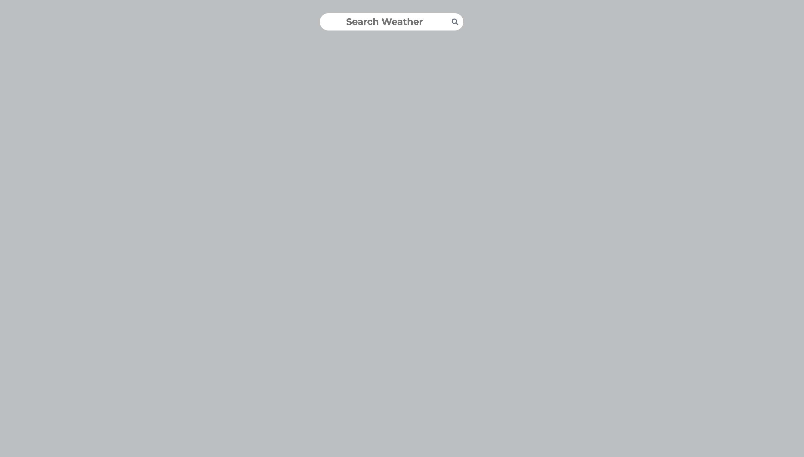
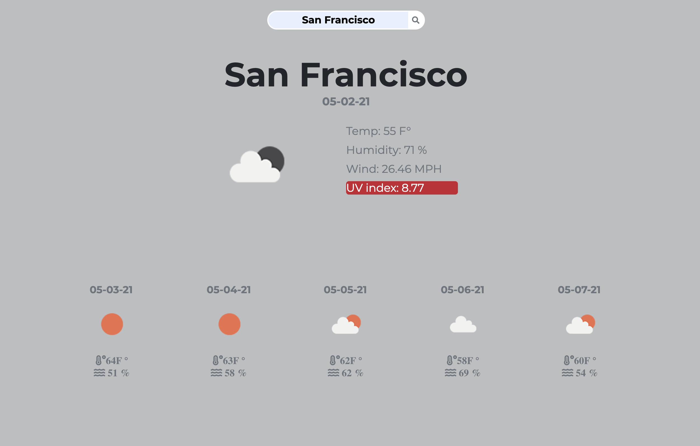
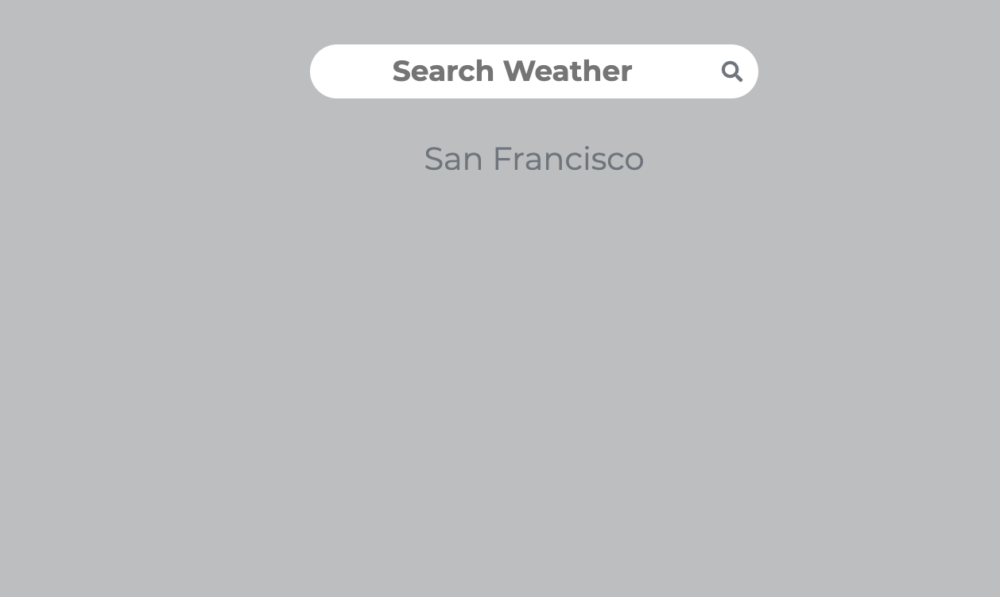

# Weather Dashboard 
this is a simple weather web app. You search for a city or a place and it will give you the following: 
* current temperture 
* current humidity 
* Wind speed
* provides a color coded uv index for the day time
* Weather icons for all types of weather 
* 5 day forecast for the area 
* quick search last location 

## Weather data 
This app uses OpenWeather Api to get the current weather data and the 5 day forecast. Also the weather icons are from OpenWeather

## Functionality

* when you first open it you are greeted with a search bar 
* search for your desired location 

* you will see the current weather and the 5 day forecast 
* the Uv tab will change color depending on how high the uv index is
### UV Index
* **Green** uv index is under 2 
* **Yellow** uv index is over 2 but under 8
* **Red** uv index is over 8 
### 5 day forecast 
* the 5 day forecast gives you the temp and humidity for 5 days 
### history 

* your last search city will be displayed as a button for quick search next time you open the web page 

